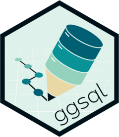

<!-- README.md is generated from README.Rmd. Please edit that file -->

# ggsql 

<!-- badges: start -->

<!-- badges: end -->

The ggsql R package provides rust bindings to the
[ggsql](https://ggsql.org) visualization tool so that you can hook up
readers and writers to it, execute queries, and visualize the result. It
also contain a knitr engine for supporting `ggsql` blocks, with
facilities for bidirectional data flow between R, Python, and ggsql
blocks. This means that you can prepare some data in one block using
dplyr or pandas, and then visualize it with ggsql in a different block
without having to do anything to pass the data around.

## Installation

You can install the development version of ggsql from
[GitHub](https://github.com/) with:

``` r
# install.packages("pak")
pak::pak("posit-dev/ggsql")
```

## Example

While one of the core appeals of the ggsql R package is the knitr engine
it provides, you can also use it directly in R to execute visual
queries:

``` r
library(ggsql)

# Create an in-memory DuckDB reader
reader <- duckdb_reader()

# Register a dataset in it
ggsql_register(reader, mtcars, "amazing_data")

# Visualize it with a query
ggsql_execute(reader, "
VISUALIZE mpg AS x, disp AS y FROM amazing_data
DRAW point
")
```

We could achieve the same in a ggsql code block by referencing an R
dataset directly using the `r:` prefix

``` ggsql
VISUALIZE mpg AS x, disp AS y FROM r:mtcars
DRAW point
LABEL
  title => 'That data came from R 🤯'
```

<div id="ggsql-vis-2" style="width: 672px; height: 480px;">

</div>

<script type="text/javascript">
(function() {
  const spec = {
  "$schema": "https://vega.github.io/schema/vega-lite/v6.json",
  "config": {
    "axis": {
      "domain": false,
      "grid": true,
      "gridColor": "#FFFFFF",
      "gridWidth": 1,
      "labelColor": "#4D4D4D",
      "labelFontSize": 12,
      "tickColor": "#333333",
      "tickSize": 4,
      "titleColor": "#000000",
      "titleFontSize": 15,
      "titleFontWeight": "normal",
      "titlePadding": 10
    },
    "header": {
      "labelColor": "#000000",
      "labelFontSize": 15,
      "labelFontWeight": "normal",
      "labelPadding": 5,
      "title": null
    },
    "legend": {
      "labelColor": "#4D4D4D",
      "labelFontSize": 12,
      "rowPadding": 6,
      "titleColor": "#000000",
      "titleFontSize": 15,
      "titleFontWeight": "normal",
      "titlePadding": 8
    },
    "title": {
      "anchor": "start",
      "color": "#000000",
      "fontSize": 18,
      "fontWeight": "normal",
      "frame": "group",
      "offset": 10,
      "subtitleColor": "#4D4D4D",
      "subtitleFontSize": 15,
      "subtitleFontWeight": "normal"
    },
    "view": {
      "fill": "#EBEBEB",
      "stroke": null
    }
  },
  "data": {
    "values": [
      {
        "__ggsql_aes_pos1__": 21.0,
        "__ggsql_aes_pos2__": 160.0,
        "__ggsql_row_index__": 0,
        "__ggsql_source__": "__ggsql_layer_0__"
      },
      {
        "__ggsql_aes_pos1__": 21.0,
        "__ggsql_aes_pos2__": 160.0,
        "__ggsql_row_index__": 1,
        "__ggsql_source__": "__ggsql_layer_0__"
      },
      {
        "__ggsql_aes_pos1__": 22.8,
        "__ggsql_aes_pos2__": 108.0,
        "__ggsql_row_index__": 2,
        "__ggsql_source__": "__ggsql_layer_0__"
      },
      {
        "__ggsql_aes_pos1__": 21.4,
        "__ggsql_aes_pos2__": 258.0,
        "__ggsql_row_index__": 3,
        "__ggsql_source__": "__ggsql_layer_0__"
      },
      {
        "__ggsql_aes_pos1__": 18.7,
        "__ggsql_aes_pos2__": 360.0,
        "__ggsql_row_index__": 4,
        "__ggsql_source__": "__ggsql_layer_0__"
      },
      {
        "__ggsql_aes_pos1__": 18.1,
        "__ggsql_aes_pos2__": 225.0,
        "__ggsql_row_index__": 5,
        "__ggsql_source__": "__ggsql_layer_0__"
      },
      {
        "__ggsql_aes_pos1__": 14.3,
        "__ggsql_aes_pos2__": 360.0,
        "__ggsql_row_index__": 6,
        "__ggsql_source__": "__ggsql_layer_0__"
      },
      {
        "__ggsql_aes_pos1__": 24.4,
        "__ggsql_aes_pos2__": 146.7,
        "__ggsql_row_index__": 7,
        "__ggsql_source__": "__ggsql_layer_0__"
      },
      {
        "__ggsql_aes_pos1__": 22.8,
        "__ggsql_aes_pos2__": 140.8,
        "__ggsql_row_index__": 8,
        "__ggsql_source__": "__ggsql_layer_0__"
      },
      {
        "__ggsql_aes_pos1__": 19.2,
        "__ggsql_aes_pos2__": 167.6,
        "__ggsql_row_index__": 9,
        "__ggsql_source__": "__ggsql_layer_0__"
      },
      {
        "__ggsql_aes_pos1__": 17.8,
        "__ggsql_aes_pos2__": 167.6,
        "__ggsql_row_index__": 10,
        "__ggsql_source__": "__ggsql_layer_0__"
      },
      {
        "__ggsql_aes_pos1__": 16.4,
        "__ggsql_aes_pos2__": 275.8,
        "__ggsql_row_index__": 11,
        "__ggsql_source__": "__ggsql_layer_0__"
      },
      {
        "__ggsql_aes_pos1__": 17.3,
        "__ggsql_aes_pos2__": 275.8,
        "__ggsql_row_index__": 12,
        "__ggsql_source__": "__ggsql_layer_0__"
      },
      {
        "__ggsql_aes_pos1__": 15.2,
        "__ggsql_aes_pos2__": 275.8,
        "__ggsql_row_index__": 13,
        "__ggsql_source__": "__ggsql_layer_0__"
      },
      {
        "__ggsql_aes_pos1__": 10.4,
        "__ggsql_aes_pos2__": 472.0,
        "__ggsql_row_index__": 14,
        "__ggsql_source__": "__ggsql_layer_0__"
      },
      {
        "__ggsql_aes_pos1__": 10.4,
        "__ggsql_aes_pos2__": 460.0,
        "__ggsql_row_index__": 15,
        "__ggsql_source__": "__ggsql_layer_0__"
      },
      {
        "__ggsql_aes_pos1__": 14.7,
        "__ggsql_aes_pos2__": 440.0,
        "__ggsql_row_index__": 16,
        "__ggsql_source__": "__ggsql_layer_0__"
      },
      {
        "__ggsql_aes_pos1__": 32.4,
        "__ggsql_aes_pos2__": 78.7,
        "__ggsql_row_index__": 17,
        "__ggsql_source__": "__ggsql_layer_0__"
      },
      {
        "__ggsql_aes_pos1__": 30.4,
        "__ggsql_aes_pos2__": 75.7,
        "__ggsql_row_index__": 18,
        "__ggsql_source__": "__ggsql_layer_0__"
      },
      {
        "__ggsql_aes_pos1__": 33.9,
        "__ggsql_aes_pos2__": 71.1,
        "__ggsql_row_index__": 19,
        "__ggsql_source__": "__ggsql_layer_0__"
      },
      {
        "__ggsql_aes_pos1__": 21.5,
        "__ggsql_aes_pos2__": 120.1,
        "__ggsql_row_index__": 20,
        "__ggsql_source__": "__ggsql_layer_0__"
      },
      {
        "__ggsql_aes_pos1__": 15.5,
        "__ggsql_aes_pos2__": 318.0,
        "__ggsql_row_index__": 21,
        "__ggsql_source__": "__ggsql_layer_0__"
      },
      {
        "__ggsql_aes_pos1__": 15.2,
        "__ggsql_aes_pos2__": 304.0,
        "__ggsql_row_index__": 22,
        "__ggsql_source__": "__ggsql_layer_0__"
      },
      {
        "__ggsql_aes_pos1__": 13.3,
        "__ggsql_aes_pos2__": 350.0,
        "__ggsql_row_index__": 23,
        "__ggsql_source__": "__ggsql_layer_0__"
      },
      {
        "__ggsql_aes_pos1__": 19.2,
        "__ggsql_aes_pos2__": 400.0,
        "__ggsql_row_index__": 24,
        "__ggsql_source__": "__ggsql_layer_0__"
      },
      {
        "__ggsql_aes_pos1__": 27.3,
        "__ggsql_aes_pos2__": 79.0,
        "__ggsql_row_index__": 25,
        "__ggsql_source__": "__ggsql_layer_0__"
      },
      {
        "__ggsql_aes_pos1__": 26.0,
        "__ggsql_aes_pos2__": 120.3,
        "__ggsql_row_index__": 26,
        "__ggsql_source__": "__ggsql_layer_0__"
      },
      {
        "__ggsql_aes_pos1__": 30.4,
        "__ggsql_aes_pos2__": 95.1,
        "__ggsql_row_index__": 27,
        "__ggsql_source__": "__ggsql_layer_0__"
      },
      {
        "__ggsql_aes_pos1__": 15.8,
        "__ggsql_aes_pos2__": 351.0,
        "__ggsql_row_index__": 28,
        "__ggsql_source__": "__ggsql_layer_0__"
      },
      {
        "__ggsql_aes_pos1__": 19.7,
        "__ggsql_aes_pos2__": 145.0,
        "__ggsql_row_index__": 29,
        "__ggsql_source__": "__ggsql_layer_0__"
      },
      {
        "__ggsql_aes_pos1__": 15.0,
        "__ggsql_aes_pos2__": 301.0,
        "__ggsql_row_index__": 30,
        "__ggsql_source__": "__ggsql_layer_0__"
      },
      {
        "__ggsql_aes_pos1__": 21.4,
        "__ggsql_aes_pos2__": 121.0,
        "__ggsql_row_index__": 31,
        "__ggsql_source__": "__ggsql_layer_0__"
      }
    ]
  },
  "height": "container",
  "layer": [
    {
      "encoding": {
        "fill": {
          "value": "black"
        },
        "fillOpacity": {
          "value": 0.8
        },
        "shape": {
          "value": "circle"
        },
        "size": {
          "value": 50.26548245743668
        },
        "stroke": {
          "value": "black"
        },
        "strokeWidth": {
          "value": 1.3333333333333333
        },
        "x": {
          "axis": {
            "labelExpr": "datum.label == '20' ? '20' : datum.label == '15' ? '15' : datum.label == '25' ? '25' : datum.label == '10' ? '10' : datum.label == '30' ? '30' : datum.label == '35' ? '35' : datum.label",
            "values": [
              10.0,
              15.0,
              20.0,
              25.0,
              30.0,
              35.0
            ]
          },
          "field": "__ggsql_aes_pos1__",
          "scale": {
            "domain": [
              9.225,
              35.074999999999996
            ],
            "zero": false
          },
          "title": "mpg",
          "type": "quantitative"
        },
        "y": {
          "axis": {
            "labelExpr": "datum.label == '200' ? '200' : datum.label == '100' ? '100' : datum.label == '400' ? '400' : datum.label == '300' ? '300' : datum.label",
            "values": [
              100.0,
              200.0,
              300.0,
              400.0
            ]
          },
          "field": "__ggsql_aes_pos2__",
          "scale": {
            "domain": [
              51.05499999999999,
              492.045
            ],
            "zero": false
          },
          "stack": null,
          "title": "disp",
          "type": "quantitative"
        }
      },
      "mark": {
        "clip": true,
        "type": "point"
      },
      "transform": [
        {
          "filter": {
            "equal": "__ggsql_layer_0__",
            "field": "__ggsql_source__"
          }
        }
      ]
    }
  ],
  "title": "That data came from R 🤯",
  "width": "container"
};
  const visId = "ggsql-vis-2";
&#10;  function loadScript(src) {
    return new Promise((resolve, reject) => {
      // Reuse already-loaded scripts
      if (document.querySelector('script[src="' + src + '"]')) {
        return resolve();
      }
      const script = document.createElement("script");
      script.src = src;
      script.onload = resolve;
      script.onerror = reject;
      document.head.appendChild(script);
    });
  }
&#10;  loadScript("https://cdn.jsdelivr.net/npm/vega@6/build/vega.min.js")
    .then(() => loadScript("https://cdn.jsdelivr.net/npm/vega-lite@6/build/vega-lite.min.js"))
    .then(() => loadScript("https://cdn.jsdelivr.net/npm/vega-embed@7/build/vega-embed.min.js"))
    .then(() => vegaEmbed("#" + visId, spec, {"actions": true}))
    .catch(err => {
      document.getElementById(visId).innerText = "Failed to load Vega: " + err;
    });
})();
</script>

The only thing you need to remember is to load ggsql into R in your
Rmarkdown/Quarto document so the knitr engine is registered.
